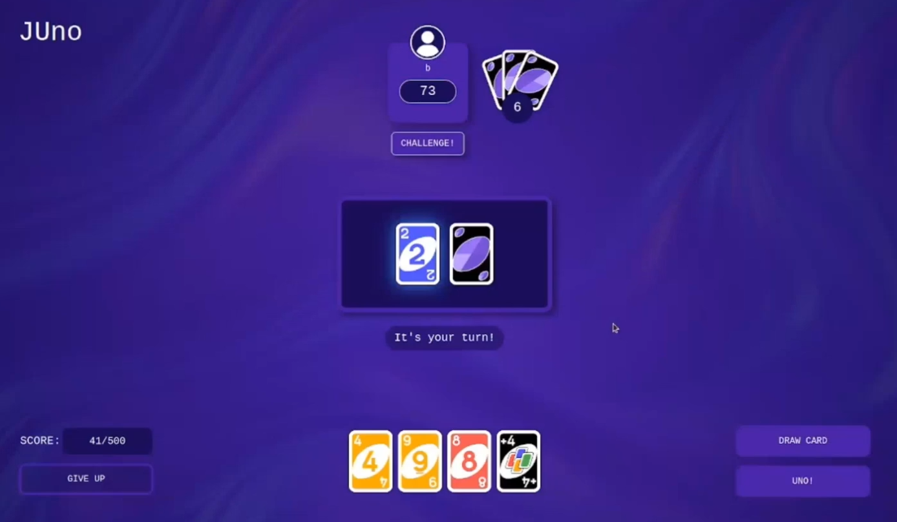

# Uno Game Project

This project is a real-time multiplayer Uno game for up to 4 players. The application consists of a front-end, a back-end, and a real-time communication system using WebSockets. Below is a description of the technologies used and how to set up and run the project.

>⚠️ Important Notice ⚠️ This repository is public for reference purposes only. Copying, modifying, or reusing any part of this code is not allowed. If you need more information, please contact me.

## Demo

You can watch a demo of the game to see how the real-time gameplay works.

[**Watch Demo Video**](./doc/demo.mp4)  

## Technologies Used

### Frontend
- **React**: The user interface is built using React to ensure a dynamic and responsive experience.
- **Tailwind CSS**: Tailwind is used for utility-first CSS styling, making the design both clean and customizable.
- **Electron.js**: The application is packaged as a desktop app using Electron, allowing the game to run as a cross-platform application.

### Backend
- **Express.js**: The backend is built with Express.js, handling API routes, player sessions, and game state management.
- **MongoDB**: MongoDB is used as the database for storing user data, game history, and other persistent information.
- **Mongoose**: Mongoose is used as the ODM (Object Data Modeling) library to interact with MongoDB more efficiently.

### Real-time Communication
- **WebSockets**: Real-time gameplay is implemented using WebSockets, allowing players to interact with the game instantly and synchronize the game state across all clients.

### Testing
- **Jest**: The backend and core logic are tested using Jest to ensure the game's functionality is robust and error-free.

## Features
- **Multiplayer Support**: Up to 4 players can join a game and play Uno in real-time.
- **Real-time Gameplay**: Players can see actions performed by others instantly, with no delay in gameplay.
- **Game State Management**: The game state is synchronized between all players, ensuring the consistency of the game across all clients.
- **User Authentication**: Players can log in and join games with a unique session.

## Prerequisites
- Node.js (version 14 or higher)
- MongoDB (local or cloud instance)

